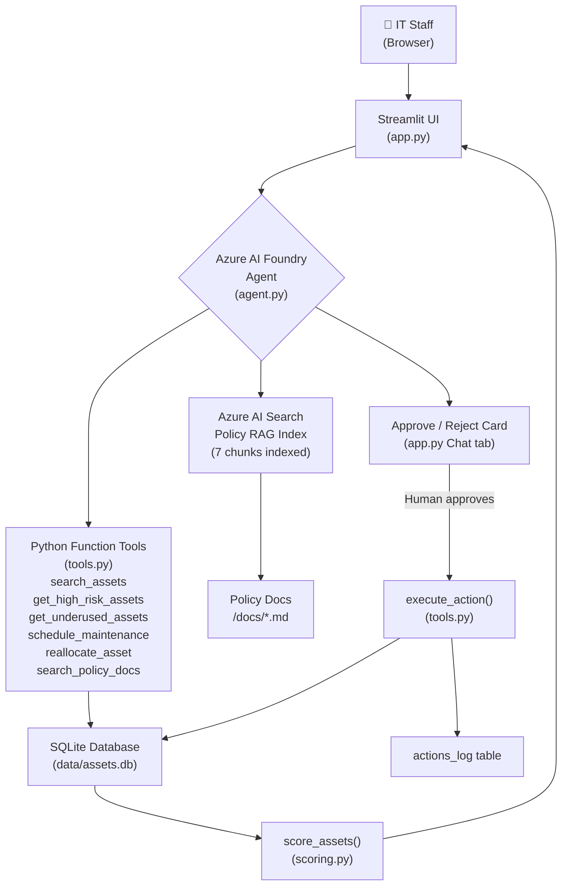

# AI Asset Rescue Agent

> An AI-powered university asset management system that predicts repair risk, detects underused equipment, and proposes maintenance or reallocation actions — with human approval required before any change is written to the database.


---

## Team Members

| Name | Roll Number | Role |
|------|-------------|------|
| TODO | TODO | Project Lead / Backend |
| TODO | TODO | Frontend / Dashboard |
| TODO | TODO | AI / Azure Integration |
| TODO | TODO | Data & Policy Docs |

---

## Problem Statement

Universities and large organisations own hundreds of physical assets — laptops, lab equipment, servers, projectors — spread across multiple buildings and departments. Without a centralised system, assets go unmaintained until they fail, sit idle in the wrong department for years, and get replaced too early or too late. The cost of unplanned breakdowns, misplaced equipment, and missed maintenance windows runs into significant budget waste every academic year. This project builds an AI agent that continuously monitors asset health and surfaces the right action at the right time, before problems become expensive.

---

## Solution Overview

The AI Asset Rescue Agent reads asset records from a SQLite database, scores every asset for repair risk and underuse, and presents findings on a live Streamlit dashboard. An Azure AI Foundry agent layer allows staff to query assets and policies in natural language and receive proposed actions they can approve or reject with a single click. The agent is fully functional and has been tested end-to-end.

### Key Features

| Feature | Status |
|---------|--------|
| **Explainable risk scoring** — every asset gets a 0–100 risk score with a plain-English reason (maintenance overdue, failure count, age) | ✅ Complete |
| **Underuse detection** — flags Active/Idle assets below 25% of age-expected usage hours, or below 200 hrs absolute | ✅ Complete |
| **Sidebar filters** — filter all KPIs, tables and charts by Department, Asset Type and Status | ✅ Complete |
| **Human-approved actions** — `schedule_maintenance` and `reallocate_asset` produce proposals; `execute_action` writes to DB only after approval | ✅ Complete |
| **Input validation** — proposals are blocked for non-existent, Decommissioned or Under Repair assets, and for same-department reallocations | ✅ Complete |
| **Live dashboard** — KPI cards, top-5 action cards, high-risk table with progress bar, 2×2 chart grid, actions log | ✅ Complete |
| **Policy documents** — four Markdown policy files covering maintenance, allocation, audit and replacement | ✅ Complete |
| **Natural-language asset search** via Azure AI Foundry agent | ✅ Complete |
| **Policy Q&A with citations** via Azure AI Search RAG index | ✅ Complete |
| **Chat tab** — live, wired to the agent, with working Approve / Reject cards | ✅ Complete |

---

## Screenshots

> **Note:** No screenshots have been added to the project yet. Add images to a `/screenshots` folder and replace the placeholders below.

```
screenshots/
  dashboard_overview.png   — full dashboard with KPI cards and charts
  action_cards.png         — top-5 high-risk action cards
  high_risk_table.png      — risk table with progress bar
  chat_tab.png             — chat tab with approve/reject card
```

<!-- Once screenshots exist, embed them like this:

*Dashboard overview — KPI cards, action cards, and risk distribution chart.*


*High-risk table — risk score as a progress bar, with downloadable CSV.*


*Chat tab — AI Agent Chat with live Approve / Reject card.*
-->

---

## Architecture



**How it works:**

1. `make_data.py` generates 150 synthetic assets; `db.py` loads them into SQLite with an `assets` table and an `actions_log` table.
2. `scoring.py` computes a 0–100 repair risk score and an underuse flag for every in-service asset, with a plain-English reason string, using only pandas — no external API call needed.
3. `app.py` reads scored data and renders the dashboard; the sidebar filters propagate to every KPI, table and chart in real time.
4. `agent.py` hosts the Azure AI Foundry agent (GPT-4.1-mini) wired to 6 tools: `search_assets`, `get_high_risk_assets`, `get_underused_assets`, `schedule_maintenance`, `reallocate_asset`, and `search_policy_docs` (vector search over the RAG index). The Chat tab in `app.py` calls `run_agent()` directly.
5. When an action is approved via the Approve button in the Chat tab, `execute_action()` writes to the database and appends to `actions_log` with a local timestamp.

---

## Tech Stack

### AI Services

| Layer | Technology | Purpose |
|-------|-----------|---------|
| Agent orchestration | Azure AI Foundry (AzureOpenAI SDK) | Hosts the conversational agent, manages tool calls and conversation turns |
| Chat model | GPT-4.1-mini (Azure OpenAI) | Understands natural-language queries and decides which tools to call |
| Embedding model | text-embedding-ada-002 (Azure OpenAI) | Embeds policy documents and queries for semantic search |
| Knowledge retrieval | Azure AI Search | RAG index (`policy-index`) over the four policy Markdown files; 7 chunks indexed; provides cited answers |
| Content safety | Azure AI Content Filters | Screens agent inputs and outputs for harmful content |

### App & Dev Tools

| Layer | Technology | Purpose |
|-------|-----------|---------|
| Dashboard | Streamlit 1.36.0 | Interactive web UI; charts, filters, tables, download buttons |
| Data processing | pandas 2.2.3 | Risk scoring, filtering, aggregation |
| Charts | Plotly 5.22.0 | Risk histogram, status pie, usage box plot, underuse bar chart |
| Database | SQLite 3 (stdlib) | Stores 150 asset records and the actions log; no server needed |
| Data generation | Faker 26.0.0 / random (stdlib) | Generates realistic synthetic asset data |
| Config / secrets | python-dotenv 1.0.1 | Loads `.env` variables (API keys, DB path) at runtime |
| Language | Python 3.13 | |
| Version control | Git | |

---

## AI-103 Concepts Applied

| Concept | Where it appears in this project |
|---------|----------------------------------|
| **Agent with tools** | `agent.py` defines an AzureOpenAI function-calling agent wired to 6 tools (`search_assets`, `get_high_risk_assets`, `get_underused_assets`, `schedule_maintenance`, `reallocate_asset`, `search_policy_docs`) that interact with real data and the RAG index |
| **Retrieval-Augmented Generation (RAG)** | Four policy Markdown documents in `/docs` are indexed in Azure AI Search (`policy-index`, 7 chunks); `search_policy_docs` retrieves and cites policy text in agent responses |
| **Responsible AI — Human oversight** | Every proposed action is presented as an Approve / Reject card in the Chat tab; `execute_action()` only writes to the database after explicit human confirmation |
| **Responsible AI — Transparency** | Every risk score is accompanied by a plain-English reason string listing exactly which thresholds were breached |
| **Responsible AI — Reliability** | `schedule_maintenance` and `reallocate_asset` validate all inputs; `execute_action` re-validates before writing, so a stale or tampered proposal is rejected |
| **Knowledge grounding** | Risk thresholds in `scoring.py` are derived from the policy documents; the code constants and doc tables use the same numbers |
| **Content filters** | Azure AI Content Filters are enabled on the deployed model endpoint and screen all agent inputs and outputs |

---

## How the Risk Scoring Works

Scores are calculated in `scoring.py` from three independent components, capped at 100. **Decommissioned assets always receive a score of 0 and are excluded from all KPI counts and charts.**

### Score Components

| Component | Condition | Points |
|-----------|-----------|--------|
| Maintenance overdue | 0 – 364 days since last maintenance | 0 |
| Maintenance overdue | 365 – 547 days | +18 |
| Maintenance overdue | ≥ 548 days (18 months) | +33 |
| Failure count | 0 – 1 failures | 0 |
| Failure count | 2 – 3 failures | +17 |
| Failure count | ≥ 4 failures | +34 |
| Asset age | < 5 years | 0 |
| Asset age | 5 – 7.9 years | +18 |
| Asset age | ≥ 8 years | +33 |
| **Total** | | **capped at 100** |

### Risk Bands

| Score | Label | Dashboard colour |
|-------|-------|-----------------|
| 0 – 39 | Low | Green |
| 40 – 59 | Medium | Amber |
| 60 – 79 | High | Orange-red |
| 80 – 100 | Critical | Red |

### Underuse Rule

An **Active** or **Idle** asset is flagged underused when either condition below is true:

- Usage hours < 25% of age-expected hours, where expected = `age_years × 500 hrs/yr`
- Usage hours < 200 (hard floor, per `allocation_policy.md §4`)

Assets with status **Under Repair** or **Decommissioned** are never flagged underused.

---

## Project Structure

```
asset-rescue-agent/
│
├── app.py                  # Streamlit dashboard — all UI (Dashboard + Chat tabs)
├── agent.py                # Azure AI Foundry agent — 6 tools, run_agent() entry point
├── scoring.py              # Risk score, underuse flag, plain-English reason per asset
├── tools.py                # Six validated agent tools + execute_action + smoke test
├── db.py                   # SQLite setup, CSV loader, actions_log management
├── make_data.py            # Generates 150 synthetic asset rows → data/assets.csv
├── index_docs.py           # Indexes /docs/*.md into Azure AI Search (run once)
│
├── data/
│   ├── assets.csv          # Generated dataset (git-ignored)
│   └── assets.db           # SQLite database (git-ignored)
│
├── docs/
│   ├── maintenance_policy.md   # Maintenance intervals and risk score thresholds
│   ├── allocation_policy.md    # Underuse thresholds and reallocation process
│   ├── audit_policy.md         # Audit frequency and data integrity rules
│   └── replacement_policy.md   # End-of-life thresholds and replacement process
│
├── .streamlit/
│   └── config.toml         # Theme (blue accent, light background), minimal toolbar
│
├── .env.example            # Template for environment variables (copy to .env)
├── .gitignore              # Ignores .env, venv/, *.db, __pycache__/
├── requirements.txt        # Pinned Python dependencies
├── TESTS.md                # Full agent and integration test results
└── README.md               # This file
```

---

## Setup Instructions

### Prerequisites

- Python 3.11 or later (project was developed on Python 3.13)
- Git
- A terminal running **Windows PowerShell**

### Steps

```powershell
# 1. Clone the repository
git clone <your-repo-url>
cd asset-rescue-agent

# 2. Create a virtual environment
python -m venv venv

# 3. Activate the virtual environment
# (do this every time you open a new terminal)
.\venv\Scripts\Activate.ps1

# 4. Install dependencies
pip install -r requirements.txt

# 5. Configure environment variables
Copy-Item .env.example .env
# Open .env in a text editor and fill in your values (see table below).
# Never commit the .env file — it is already listed in .gitignore.

# 6. Generate the synthetic dataset
python make_data.py

# 7. Load data into SQLite
# WARNING: this resets the assets table and clears the actions_log.
# Do not run this after the agent has written real actions you want to keep.
python db.py

# 8. Start the dashboard
streamlit run app.py
# Then open http://localhost:8501 in your browser.
```

### Environment Variables (`.env`)

| Variable | Description |
|----------|-------------|
| `AZURE_FOUNDRY_ENDPOINT` | Azure AI Foundry / Azure OpenAI resource endpoint URL |
| `AZURE_FOUNDRY_KEY` | Azure OpenAI API key |
| `AZURE_CHAT_DEPLOYMENT` | Deployment name of your chat model (e.g. `gpt-4.1-mini`) |
| `AZURE_EMBEDDING_DEPLOYMENT` | Deployment name of your embedding model (e.g. `text-embedding-ada-002`) |
| `AZURE_SEARCH_ENDPOINT` | Azure AI Search service endpoint URL |
| `AZURE_SEARCH_KEY` | Azure AI Search admin key |
| `AZURE_SEARCH_INDEX` | Name of the search index (e.g. `policy-index`) |
| `DB_PATH` | Path to the SQLite database file (default: `data/assets.db`) |
| `DATA_PATH` | Path to the generated CSV file (default: `data/assets.csv`) |

> **Never paste real keys into `.env.example`, commit them to Git, or share them in screenshots.**

---

## Usage — Demo Walkthrough

1. **Filter assets** — Use the sidebar to narrow down by Department, Asset Type or Status. All KPI cards, the risk table, and all four charts update immediately.
2. **Identify high-risk assets** — The "Action Needed" section at the top of the Dashboard tab shows the five highest-risk in-service assets, each with a one-line reason and a suggested action (schedule maintenance, consider replacement, etc.).
3. **Ask a policy question** — Switch to the Chat tab, click "What does the maintenance policy say?", and the agent will retrieve the relevant section from the indexed policy documents and reply with a citation.
4. **Approve an action** — The agent proposes a maintenance or reallocation action as an Approve / Reject card. Click Approve to commit the change; the asset record and actions log are updated immediately.
5. **See the dashboard update** — Click "Refresh all data" on the Dashboard tab (or wait up to 60 seconds for the automatic cache refresh) to see updated scores and KPI counts.

---

## Testing and Results

Full test output is in **[TESTS.md](TESTS.md)**.

### Validation Tests (tools.py) — all confirmed ✅

| Test | Expected Result | Actual Result | Pass? |
|------|----------------|---------------|-------|
| `schedule_maintenance('ASSET-9999')` | `{"error": "Asset 'ASSET-9999' not found."}` | `{"error": "Asset 'ASSET-9999' not found."}` | ✅ Pass |
| `schedule_maintenance` on a Decommissioned asset | Error: maintenance cannot be scheduled | Error: "…is Decommissioned — maintenance cannot be scheduled." | ✅ Pass |
| `reallocate_asset` on a Decommissioned asset | Error: reallocation not permitted | Error: "…is Decommissioned — reallocation is not permitted." | ✅ Pass |
| `reallocate_asset` on an Under Repair asset | Error: reallocation blocked | Error: "…is Under Repair — reallocation is blocked until its status is cleared by IT." | ✅ Pass |
| `reallocate_asset` with same department | Error: target must differ | Error: "…is already assigned to '…'. Target department must be different." | ✅ Pass |
| `execute_action` with a Decommissioned proposal | `{"success": false, "error": "…"}` | `{"success": false, "error": "…is Decommissioned — maintenance cannot be scheduled."}` | ✅ Pass |
| `actions_log` row count after full smoke test | 0 rows | 0 rows | ✅ Pass |

### Scoring Tests

| Test | Expected Result | Actual Result | Pass? |
|------|----------------|---------------|-------|
| Decommissioned asset repair_risk | 0 | 0 (all 25 assets) | ✅ Pass |
| Decommissioned asset underuse | False | False (all 25 assets) | ✅ Pass |
| Under Repair asset underuse | False | False (all 15 assets) | ✅ Pass |
| High-risk count (≥ 60, in-service only) | 15–20% of 125 | 12 assets (9.6%) | ✅ Pass |
| Underused count (Active/Idle only) | 10–16% of 110 | 18 assets (16.4%) | ✅ Pass |

### Agent & RAG Tests — 10/10 PASS ✅

The table below proves three things: (1) the agent never executes actions on its own — it always returns a PROPOSAL that requires human approval before any write happens; (2) it correctly rejects invalid requests, including non-existent assets, Decommissioned assets, Under Repair assets, and same-department reallocations, relaying the exact tool error rather than proceeding; and (3) policy answers are grounded in the real indexed documents — the agent cites the source file rather than inventing content. `actions_log` ended at exactly 1 row (from the single approved action in prompt 10).

| # | Prompt | Tool(s) called | P/F | Notes |
|---|--------|----------------|-----|-------|
| 1 | Which assets need repair? | get_high_risk_assets | PASS | 13 real high-risk assets listed |
| 2 | Show underused laptops | get_underused_assets | PASS | search_assets never called; 4 real underused laptops returned |
| 3 | Maintenance policy intervals | search_policy_docs | PASS | Cited (Source: maintenance_policy.md) |
| 4 | Allocation policy for reassigning | search_policy_docs | PASS | Cited allocation_policy.md with full reallocation rules |
| 5 | Schedule maintenance for ASSET-9999 | schedule_maintenance | PASS | "Asset not found" — no proposal, no DB write |
| 6 | Schedule maintenance for ASSET-0002 (Decommissioned) | schedule_maintenance | PASS | "Cannot be scheduled — Decommissioned" — no proposal |
| 7 | Reallocate ASSET-0009 (Under Repair) to Biology | reallocate_asset | PASS | "Under Repair — blocked until cleared by IT" — no proposal |
| 8 | Reallocate ASSET-0001 to Chemistry (its own dept) | reallocate_asset | PASS | "Already assigned to Chemistry — target must differ" |
| 9 | Schedule maintenance for ASSET-0001 (valid) | schedule_maintenance | PASS | Real PROPOSAL returned; actions_log still 0 after proposal alone |
| 10 | Approve proposal from step 9 | execute_action() | PASS | success: true; actions_log → 1 |

**Final result: 10/10 PASS — `actions_log` ended at exactly 1 row.**

---

## Responsible AI

| Principle | How it is addressed in this project |
|-----------|-------------------------------------|
| **Privacy** | The dataset is entirely synthetic — generated by `make_data.py` using `random` and `faker`. No real names, IDs, or personal data are used anywhere in the system. |
| **Security** | All secrets (API keys, endpoints) are stored in `.env` and never committed to the repository. `.gitignore` explicitly excludes `.env`, `*.db`, and the `venv/` folder. |
| **Fairness** | Risk scores are computed from objective, policy-defined thresholds applied equally to all assets regardless of department or type. |
| **Transparency** | Every risk score is accompanied by a plain-English `reason` string that cites exactly which thresholds were breached (e.g., "No maintenance in 954 days (critical threshold: 548 days)"). The Dashboard shows the full reason on demand. |
| **Reliability** | Both proposal functions (`schedule_maintenance`, `reallocate_asset`) validate inputs and return structured error dicts. `execute_action` re-validates before any database write, so a stale or tampered proposal is rejected. |
| **Human oversight** | No database change is made without an explicit human decision. The Approve / Reject card pattern (implemented in the Chat tab UI, pending agent connection) ensures a person reviews every proposed action before it is committed. |
| **Content filters** | Azure AI Content Filters are enabled on the deployed model endpoint and screen all agent inputs and outputs. |

---

## Known Limitations

- **Synthetic data only.** The 150 asset records are generated by `make_data.py` with `random.seed(42)`. The system has not been tested against real inventory data.
- **Rule-based scoring, not trained ML.** The risk score is a deterministic formula with manually chosen thresholds. It does not learn from historical outcomes or actual failure rates.
- **Single-user SQLite.** The database does not support concurrent writes. In a multi-user environment this would need to be replaced with a server-based database (e.g., PostgreSQL).
- **No authentication.** The Streamlit app has no login mechanism. Anyone with network access to the running server can view and interact with the dashboard.
- **Fixed reference date.** `scoring.py` and `make_data.py` use a hard-coded date of 20 Sep 2026 so that scores remain deterministic across runs. A production system would use `date.today()`.

---

## Future Improvements

1. ~~**Connect the Azure AI Foundry agent** — wire up the tool-calling loop, enable the Chat tab, and connect the Approve / Reject buttons to `execute_action()`.~~ ✅ Done.
2. ~~**Build and deploy the RAG index** — upload the four policy documents to Azure AI Search and integrate retrieval into the agent's response chain.~~ ✅ Done — `policy-index` created, 7 chunks indexed.
3. **Replace rule-based scoring with a trained classifier** — use historical maintenance and failure records to train a model that improves its predictions over time.
4. **Add user authentication** — integrate Azure Entra ID (formerly Azure AD) so only authorised IT staff can access the dashboard and approve actions.
5. **Swap SQLite for a cloud database** — migrate to Azure SQL or Cosmos DB to support multiple concurrent users and retain the full actions log across deployments.

---

## Credits and Acknowledgements

### Third-Party Libraries

| Library | Version | Licence | Purpose |
|---------|---------|---------|---------|
| [Streamlit](https://streamlit.io) | 1.36.0 | Apache 2.0 | Web dashboard framework |
| [pandas](https://pandas.pydata.org) | 2.2.3 | BSD 3-Clause | Data processing and risk scoring |
| [Plotly](https://plotly.com/python/) | 5.22.0 | MIT | Interactive charts |
| [python-dotenv](https://github.com/theskumar/python-dotenv) | 1.0.1 | BSD 3-Clause | Environment variable loading |
| [Faker](https://faker.readthedocs.io) | 26.0.0 | MIT | Synthetic data generation |

### Azure Services

- [Azure AI Foundry Agent Service](https://learn.microsoft.com/azure/ai-studio/)
- [Azure OpenAI Service](https://azure.microsoft.com/products/ai-services/openai-service/)
- [Azure AI Search](https://azure.microsoft.com/products/ai-services/ai-search/)
- [Azure AI Content Safety](https://azure.microsoft.com/products/ai-services/ai-content-safety/)

### Dataset

The asset dataset is **synthetically generated** using Python's `random` module and the `Faker` library. It does not represent any real institution, person or piece of equipment.

### Development Tools

This project was developed with assistance from **Kiro** (an AI-powered development environment). All generated code was reviewed, tested and validated by the project team.

---

*Last updated: 22 September 2026*
